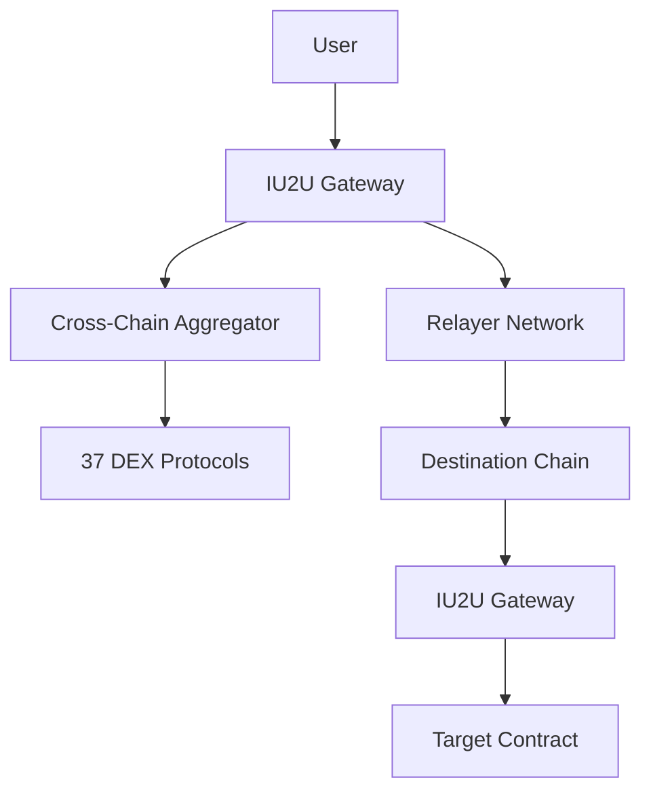

# IU2U Protocol Documentation

Welcome to the comprehensive documentation for the IU2U Protocol - a revolutionary cross-chain infrastructure that enables seamless token swaps, cross-chain communication across multiple blockchain networks.

## What is IU2U?

IU2U is a cross-chain protocol that facilitates:

- **Cross-Chain Token Transfers**: Send tokens between different blockchain networks
- **DEX Aggregation**: Access 37+ DEX protocols across 7 chains for optimal swap routing
- **General Message Passing**: Send arbitrary data and function calls across chains

## Quick Start


[installation.md](getting-started/installation.md)



[quick-start.md](getting-started/quick-start.md)


## Core Features

### 🔗 Cross-Chain Infrastructure
- Supports 7 major blockchain networks
- 1:1 XFI backing mechanism
- Decentralized relayer network

### 🔄 DEX Aggregation
- 37+ supported DEX protocols
- Optimal routing algorithms
- Multi-protocol quote comparison
- V2 and V3 concentrated liquidity support

### 🛡️ Security & Reliability
- Comprehensive audit coverage
- Decentralized architecture
- Emergency recovery mechanisms

## Supported Networks

| Network | Chain ID | Status |
|---------|----------|--------|
| Ethereum | 1 | ✅ Live |
| BSC | 56 | ✅ Live |
| Polygon | 137 | ✅ Live |
| Avalanche | 43114 | ✅ Live |
| Arbitrum | 42161 | ✅ Live |
| Optimism | 10 | ✅ Live |
| Base | 8453 | ✅ Live |

## Architecture Overview

## Getting Help

- 📖 Browse the documentation sections
- 💬 Join our [Discord community](https://discord.gg/u2u)
- 🐛 Report issues on [GitHub](https://github.com/U2U-Network/U2U-Contracts)
- 📧 Contact support: support@iu2u.com

## Documentation Structure

This documentation is organized into the following sections:

- **Getting Started**: Installation, setup, and basic usage
- **Core Concepts**: Understanding IU2U's architecture and mechanisms
- **DEX Aggregation**: Multi-protocol trading and routing
- **Cross-Chain**: Bridge operations and message passing
- **API Reference**: Complete function and event documentation
- **Guides**: Step-by-step tutorials and best practices
- **Examples**: Real-world integration patterns

---

*Ready to build with IU2U? Start with our [Quick Start Guide](getting-started/quick-start.md)!*
