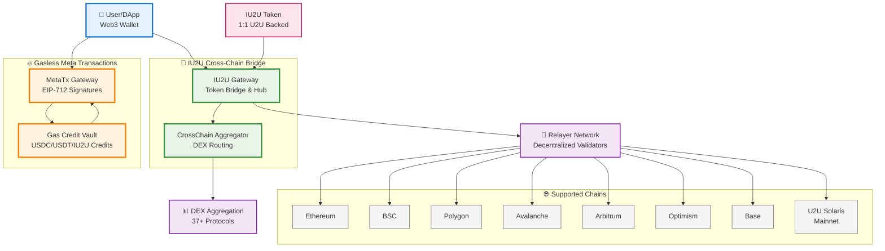

# Cross-Chain Architecture

## Architecture Overview

```mermaid
flowchart TB
    %% User Layer
    U[👤 User/DApp<br/>Web3 Wallet]
    
    %% Core Systems
    subgraph "🔥 Gasless Meta Transactions"
        MTG[MetaTx Gateway<br/>EIP-712 Signatures]
        GCV[Gas Credit Vault<br/>USDC/USDT/IU2U Credits]
    end
    
    subgraph "🌉 IU2U Cross-Chain Bridge"
        IG[IU2U Gateway<br/>Token Bridge & Hub]
        CCA[CrossChain Aggregator<br/>DEX Routing]
    end
    
    %% Supporting Systems
    DEX[📊 DEX Aggregation<br/>37+ Protocols]
    REL[🔄 Relayer Network<br/>Decentralized Validators]
    
    %% Blockchains
    subgraph "🌐 Supported Chains"
        ETH[Ethereum] 
        BSC[BSC]
        POLY[Polygon]
        AVAX[Avalanche]
        ARB[Arbitrum]
        OP[Optimism]
        BASE[Base]
        U2U[U2U Solaris<br/>Mainnet]
    end
    
    %% Token Economics
    TOK[IU2U Token<br/>1:1 U2U Backed]
    
    %% Connections
    U --> MTG
    U --> IG
    
    MTG --> GCV
    GCV --> MTG
    
    IG --> CCA
    CCA --> DEX
    
    IG --> REL
    REL --> ETH
    REL --> BSC
    REL --> POLY
    REL --> AVAX
    REL --> ARB
    REL --> OP
    REL --> BASE
    REL --> U2U
    
    TOK --> IG
    
    %% Styling for clarity
    classDef user fill:#e3f2fd,stroke:#1976d2,stroke-width:3px
    classDef meta fill:#fff3e0,stroke:#f57c00,stroke-width:3px
    classDef bridge fill:#e8f5e8,stroke:#388e3c,stroke-width:3px
    classDef support fill:#f3e5f5,stroke:#7b1fa2,stroke-width:2px
    classDef chains fill:#f5f5f5,stroke:#616161,stroke-width:1px
    classDef token fill:#fce4ec,stroke:#c2185b,stroke-width:2px
    
    class U user
    class MTG,GCV meta
    class IG,CCA bridge
    class DEX,REL support
    class ETH,BSC,POLY,AVAX,ARB,OP,BASE,U2U chains
    class TOK token

```