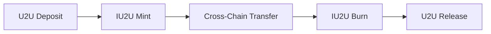

# IU2U Token

The IU2U token is the native cross-chain token of the IU2U Protocol, designed to facilitate seamless value transfer and serve as a medium of exchange across multiple blockchain networks.

## Token Overview

IU2U tokens are 1:1 backed by U2U (U2U Chain's native token) and serve as the protocol's native asset for:

- Cross-chain token transfers
- DEX aggregation operations  
- Gas fee payments in gasless transactions
- Protocol governance and staking

## Technical Specifications

### Contract Details

```solidity
// Token Information
Name: IU2U Token
Symbol: IU2U
Decimals: 18
Total Supply: Dynamic (minted/burned based on bridging)
Standard: ERC20 with cross-chain extensions
```

### Key Features

1. **Cross-Chain Native**: Deployed on multiple chains with unified balances
2. **Burnable/Mintable**: Supports cross-chain operations through burn/mint mechanisms
3. **Gasless Support**: Integrated with meta-transaction capabilities
4. **Multi-signature Security**: Relayer network validation for cross-chain operations

## Token Economics

### Supply Mechanism



1. **Minting**: IU2U tokens are minted when U2U is deposited into the protocol
2. **Burning**: IU2U tokens are burned when withdrawing to U2U
3. **Cross-Chain**: Tokens are burned on source chain and minted on destination chain

### Backing Mechanism

- **1:1 U2U Backing**: Every IU2U token is backed by 1 U2U token
- **Reserve Verification**: Smart contracts ensure proper backing at all times
- **Audit Trail**: All mint/burn operations are transparently recorded on-chain

## Cross-Chain Operations

### Bridge Mechanism

The IU2U token uses a sophisticated bridge mechanism:

1. **Lock & Mint**: On non-native chains, U2U is locked and IU2U is minted
2. **Burn & Release**: When bridging back, IU2U is burned and U2U is released
3. **Relayer Validation**: Multi-signature relayer network validates all operations

### Supported Chains

| Chain | Network ID | IU2U Address | Status |
|-------|------------|--------------|--------|
| U2U Nebulas Testnet | 2484 | `0x...` | Native |
| Ethereum | 1 | `0x...` | Deployed |
| BSC | 56 | `0x...` | Deployed |
| Polygon | 137 | `0x...` | Deployed |
| Arbitrum | 42161 | `0x...` | Deployed |
| Optimism | 10 | `0x...` | Deployed |
| Avalanche | 43114 | `0x...` | Deployed |

## Smart Contract Architecture

### Core Functions

```solidity
// Minting (Cross-chain transfers in)
function mint(address to, uint256 amount) external onlyRelayer

// Burning (Cross-chain transfers out)
function burn(uint256 amount) external

// Cross-chain call with token transfer
function callContractWithToken(
    string memory destinationChain,
    string memory contractAddress,
    bytes memory payload,
    string memory symbol,
    uint256 amount
) external
```

### Security Features

1. **Multi-signature Relayers**: Requires multiple relayer signatures for operations
2. **Command Validation**: All cross-chain commands are cryptographically verified
3. **Replay Protection**: Prevents duplicate transaction execution
4. **Rate Limiting**: Configurable limits on large transfers

## Integration Guide

### For DApp Developers

```javascript
// Get IU2U token contract
const iu2u = new ethers.Contract(IU2U_ADDRESS, IU2U_ABI, signer);

// Transfer tokens cross-chain
await iu2u.callContractWithToken(
    "ethereum",           // destination chain
    "0x...",             // destination contract
    "0x...",             // payload
    "IU2U",              // token symbol
    ethers.parseEther("100") // amount
);
```

### For DEX Integration

```javascript
// Check IU2U balance
const balance = await iu2u.balanceOf(userAddress);

// Approve for DEX trading
await iu2u.approve(dexAddress, amount);

// Use in DEX aggregation
await aggregator.swapExactTokensForTokens(
    amountIn,
    amountOutMin,
    [IU2U_ADDRESS, tokenOut],
    recipient,
    deadline
);
```

## Use Cases

### 1. Cross-Chain Arbitrage

Traders can use IU2U to:
- Identify price differences across chains
- Transfer funds quickly between DEXes
- Execute arbitrage strategies with minimal slippage

### 2. Multi-Chain DeFi

DeFi protocols can integrate IU2U to:
- Accept deposits from any supported chain
- Provide unified liquidity across chains
- Enable cross-chain yield farming

### 3. Payment Infrastructure

Merchants can use IU2U for:
- Cross-border payments
- Multi-chain invoicing
- Gasless transactions for users

## Security Considerations

### Risk Factors

1. **Bridge Security**: Cross-chain operations depend on relayer network security
2. **Smart Contract Risk**: Standard smart contract vulnerabilities apply
3. **Chain-Specific Risks**: Each blockchain has inherent risks

### Mitigation Strategies

1. **Multi-signature Validation**: No single point of failure in relayer network
2. **Formal Verification**: Core contracts undergo formal verification
3. **Bug Bounty Program**: Active security researcher engagement
4. **Regular Audits**: Quarterly security audits by leading firms

## Governance

### Token Voting Rights

IU2U holders can participate in:
- Protocol parameter updates
- New chain integrations
- Relayer network changes
- Fee structure modifications

### Proposal Process

1. **Proposal Submission**: Community members submit proposals
2. **Discussion Period**: 7-day community discussion
3. **Voting Period**: 3-day token holder voting
4. **Implementation**: Successful proposals are implemented

## Roadmap

### Short Term (Q1-Q2 2025)
- [ ] Additional DEX integrations
- [ ] Mobile wallet support
- [ ] Gas optimization improvements

### Medium Term (Q3-Q4 2025)
- [ ] Layer 2 expansion
- [ ] Institutional custody support  
- [ ] Advanced trading features

### Long Term (2026+)
- [ ] Non-EVM chain support
- [ ] Native staking mechanisms
- [ ] Advanced governance features

## Resources

- [Token Contract](../api-reference/iu2u-gateway.md)
- [Cross-Chain Guide](../cross-chain/token-transfers.md)
- [Integration Examples](../examples/basic-swap.md)
- [Security Best Practices](../guides/security.md)
